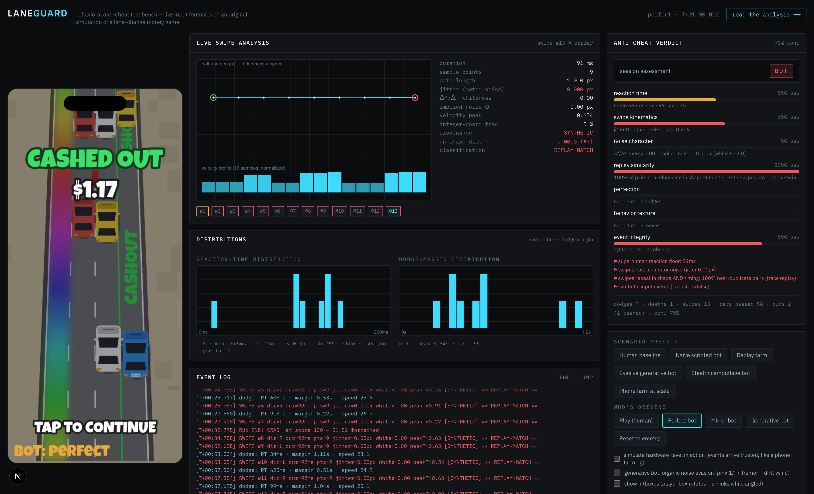
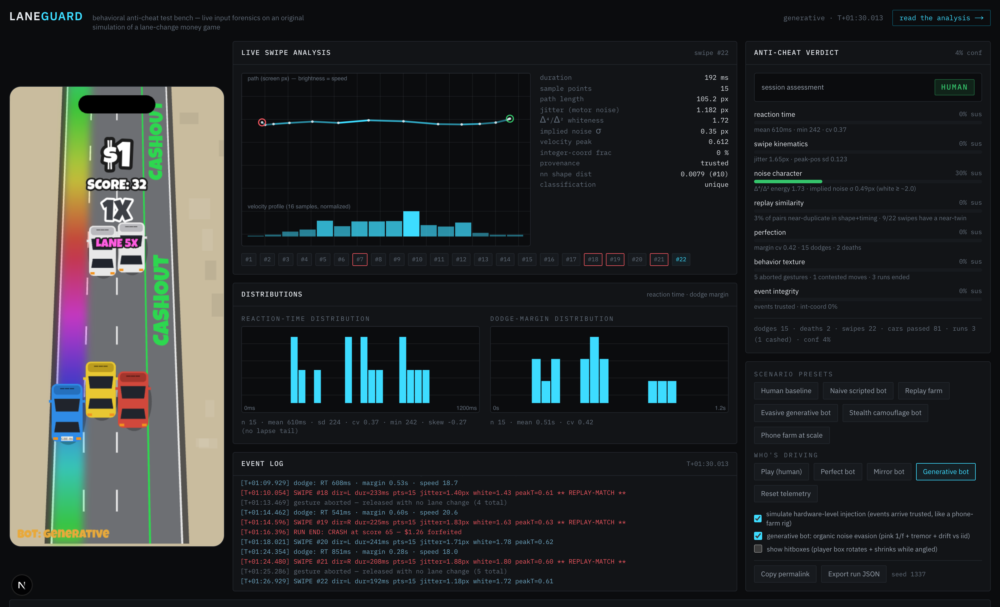
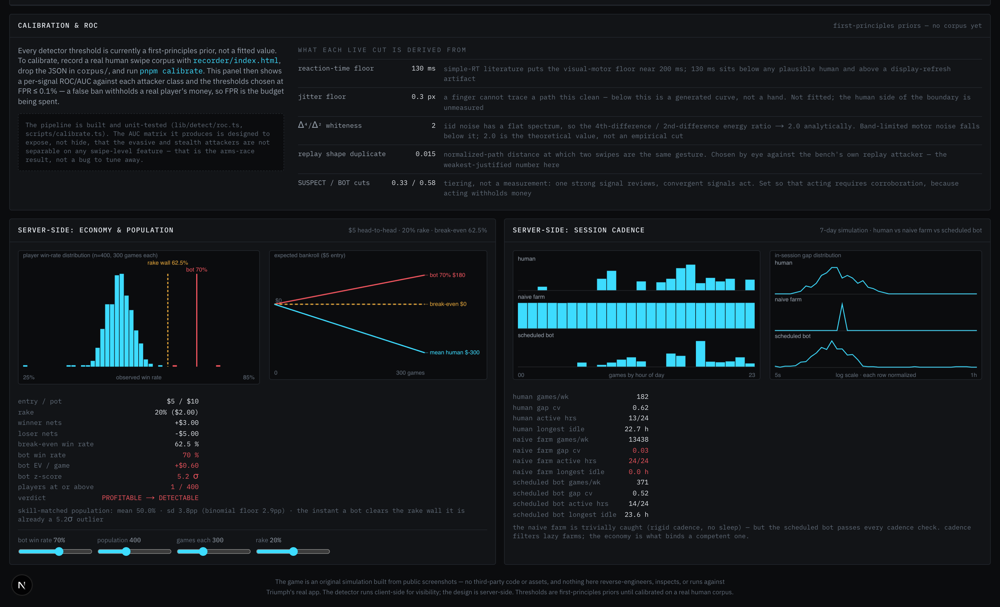

# LaneGuard

A behavioral anti-cheat **test bench** for real-money mobile skill games, built
around an original simulation of a lane-change driving game. It demonstrates the
attacker ladder against such a game — including an attacker that defeats the
whole client-side detector — and makes the honest argument that the *economics*,
not the motor forensics, are what actually bind a bot.

**[Read the analysis →](./REPORT.md)** · live writeup at `/writeup`

> **Scope.** The game is an original simulation built from public App Store
> screenshots (`references/`). Nothing here reverse-engineers, inspects, or runs
> against Triumph's real app or servers, and nothing is usable as a cheat against
> it. Every number in the UI and docs comes from code that ran; nothing is
> invented, and first-principles priors are labeled as priors.

The bench catching the naive scripted bot: four smoking-gun flags, BOT at 75%
confidence.



The stealth camouflage bot on the same detector: every signal green, HUMAN at 4%
confidence. The project is built around reporting this honestly.



## Run it

```bash
pnpm install
pnpm dev          # the bench at http://localhost:3000
pnpm test         # 84 tests: parity, determinism, attacker behavior, ROC math
pnpm batch        # regenerate the attacker/economy/cadence tables
pnpm evo          # head-to-head sweep: win rate from play, not assumption
pnpm calibrate    # fit thresholds to a human corpus (see below)
pnpm build        # static export
```

Node 22, pnpm 11, Next.js 16 (static export), TypeScript, vitest. No runtime
dependencies beyond React/Next and the Luckiest Guy webfont.

## Layout

```
lib/sim/        deterministic game engine (physics) + SAT collision — pure, DOM-free
lib/attack/     the attacker models (scripted → replay → generative → stealth)
lib/detect/     feature extraction, the 7 signals + ensemble, ROC calibration
lib/econ/       economy break-even, skill-matched population, head-to-head
                match sim (win rates from play), 7-day cadence
lib/bench/      headless deterministic session runner (the batch/test workhorse)
lib/ui/         browser controller (rAF loop) + canvas renderer + config hooks
app/, components/  the Next.js dashboard + /writeup
scripts/        batch runner + calibration pipeline + parallel evolution sweep
test/           golden-file parity vs the legacy build, determinism, behavior, ROC
legacy/         the original single-file prototype (kept for parity reference)
recorder/       LAN-servable swipe recorder for collecting a human corpus
```

The valuable logic is framework-independent and tested; the UI only reads from it.

## The attacker ladder (regenerated by `pnpm batch`, 12 seeds × 180 s)

"Ever BOT" is the enforcement question — whether the tier was reached at any
point, not just at the final tick. They are different numbers and the difference
matters.

| attacker | verdict at 180 s | ever SUSPECT | ever BOT | how it's caught (or not) |
|---|---|---|---|---|
| naive scripted | **BOT 100%** | 0/12 | **12/12** | kinematics (jitter ≈ 0) + event provenance, in seconds |
| replay farm (injected) | **BOT 100%** | 0/12 | **12/12** | replay similarity — repeats in shape *and* timing |
| evasive generative | BOT 17% | 9/12 | **5/12** | organic noise beats motor forensics; texture catches it slowly |
| **stealth camouflage** | **HUMAN 12/12** | 2/12 | **0/12** | **never actioned by the client-side detector** |

The stealth bot uses organic motor noise (pink 1/f + tremor + drift), ex-Gaussian
reaction times gated to threat onset, deliberate imperfect play (it enters
contested space and genuinely crashes for it, and fakes aborted gestures), and a
human banking discipline. That last one is not cosmetic: cashing out retires the
"never banks a run" texture flag, so adding it made the attacker simultaneously
*better at winning* (head-to-head win rate 49–53% → 54–58% across the modeled
fields) and *quieter* (SUSPECT touches 37.5% → 25% of seeds, ever-BOT unchanged
at 0). Defenders should expect a competent attacker to look **more** normal as it
gets stronger, not less — which is the wrong way round for anyone hoping better
play is itself a tell.

Three minutes doesn't separate the last two rungs, so run both to 10 minutes
(`pnpm batch --duration 600`):

| attacker | verdict at 600 s | ever SUSPECT | ever BOT | mean conf |
|---|---|---|---|---|
| evasive generative | **BOT 83%** | 9/12 | **10/12** | 0.58 |
| **stealth camouflage** | **HUMAN 12/12** | 2/12 | **0/12** | **0.04** |

Given time the detector *does* win against the evasive bot (5/12 seeds at three
minutes → 10/12 at ten). The stealth rung breaks that trend — 0/12 however long
it runs, with confidence falling as the session grows. It does transiently trip
the SUSPECT review tier on 2/12 seeds, and the writeup says so rather than
rounding it off. Keeping that honest is the point.

## Why the economy wins

$5 entry, 20% rake -> break-even win rate **62.5%**. Against a skill-matched
population (mean 50.0%, sd 3.8 pp over 300 games each), a bot sustaining 62.5% is
already a **3.3σ** outlier — only **2 of 400** simulated players match it. But
that sweep takes the win rate as an *input*, so `pnpm evo` measures it instead:
**1,196,000 head-to-head runs** (5 modeled fields x 160 players x 1,000 shared
courses, 99 attacker policies x 4 seeds), both players driving the same seeded
course so the comparison isolates play quality.

Sweeping the three things that can each decide the answer on their own — how
competent the field is, whether a crashed run still scores, and how
double-forfeit ties settle — the attacker's measured ceiling against the
strongest opposition is **56.5%** (head-to-head rule) or **52.0%** (leaderboard
rule), both well under the rake wall and both losing money.

The claim "there is no profitable-and-hidden zone" survives, but it is
conditional, and the conditions are worth more than the claim:

- **Ties are an anti-cheat control.** Refunding double-forfeits yields 16
  policies that are profitable, under 3σ, and never actioned. Raking them yields
  **0**. The attacker's margin lived in the games nobody won.
- **The scoring rule sets how detectable a winner can be.** Requiring a cash-out
  to register compresses the population win-rate spread to ~3 pp, so any
  consistent winner is loud. Letting crashed runs score widens it to ~9-10 pp,
  and a 71% bot reads as just 2.1σ. Same detector, same bot.
- **The attacker's profit is the field's mistakes.** The modeled fields bank at
  30-50 when the optimum is 12-30; that gap is the entire edge. Teaching players
  to bank well is an anti-cheat lever, and a cheaper one than a detector.

Full tables and method in [REPORT.md](REPORT.md) §5a.



## Calibration

Every detector threshold is a first-principles prior until fitted to a real human
swipe corpus. To calibrate: serve `recorder/index.html` over your LAN, record
swipes on phone + desktop, drop the JSON in `corpus/` (gitignored — it's
biometric-adjacent), and run `pnpm calibrate`. That computes a per-signal ROC/AUC
against each attacker class and picks thresholds at FPR ≤ 0.1%. Until then the UI
shows the uncalibrated-prior state and says so. **No corpus has been recorded
yet** — this is the one open item.
