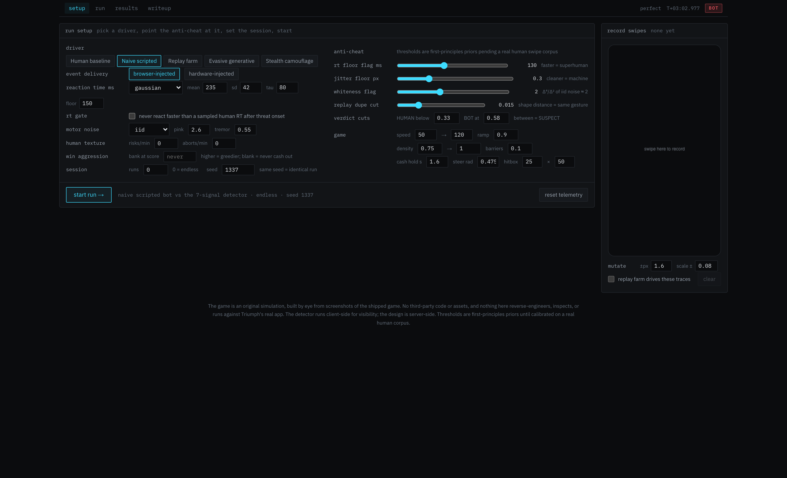
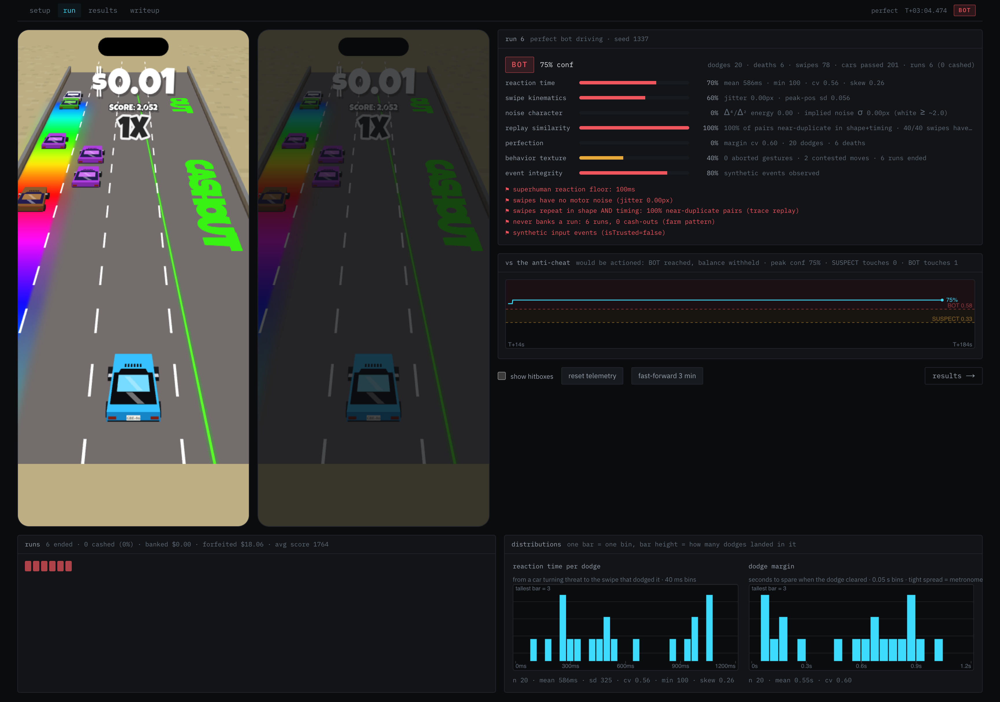
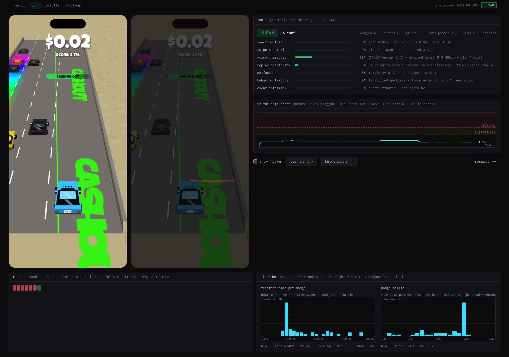
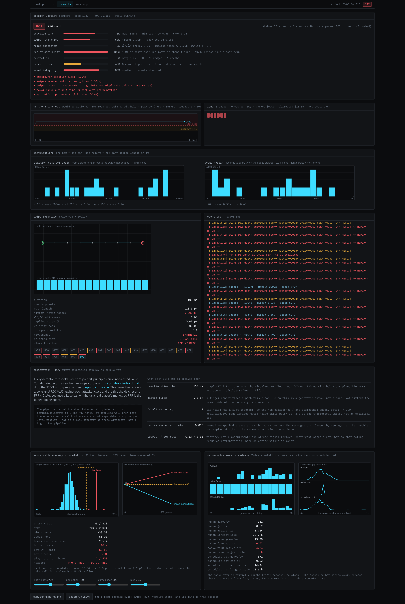
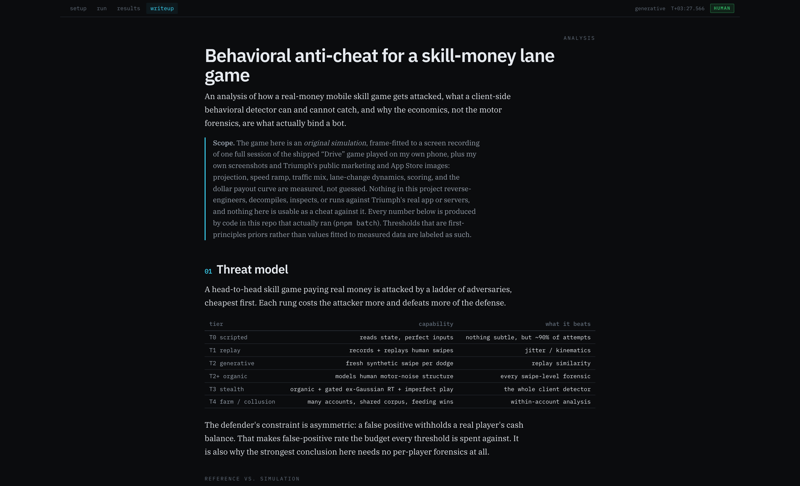

# LaneGuard

A behavioral anti-cheat **test bench** for real-money mobile skill games, built
around an original simulation of a lane-change driving game. It demonstrates the
attacker ladder against such a game, up to an attacker that defeats the whole
client-side detector, and shows that the *economics*, not the motor forensics,
are what actually bind a bot.

**Live: [laneguard.joshuakappler.com](https://laneguard.joshuakappler.com)** ·
[read the analysis →](./REPORT.md) · live writeup at `/writeup`

> **Scope.** The game is an original simulation, frame-fitted to a screen
> recording of one full session of the shipped game played on my own phone,
> plus my own screenshots and Triumph's public marketing and App Store images
> (all catalogued in `references/MANIFEST.md`): projection, speed ramp,
> traffic mix, lane-change dynamics, scoring, and the dollar payout curve are
> measured, not guessed. Nothing here reverse-engineers, decompiles, inspects,
> or runs against Triumph's real app or servers, and nothing is usable as a
> cheat against it. Every number in the UI and docs comes from code that ran;
> nothing is invented, and first-principles priors are labeled as priors.

The bench is four tabs on one nav: setup, run, results, writeup. A first visit
boots a pre-run demo (the naive scripted bot, fast-forwarded 3 sim-minutes) so
every panel arrives populated, then keeps running live. **Setup**: one run
panel, driver and anti-cheat side by side, plus a phone that records your real
swipes and mutates them into the replay-farm corpus.



**Run**: the game beside a ghost phone that traces each swipe in red at the
speed it actually happened, one-line signal bars, detector confidence over the
whole session against the SUSPECT/BOT cuts, and every completed run as a cell.
Here the naive scripted bot is caught three minutes in: five red flags, BOT at
75% confidence, and the enforcement line reading "would be actioned".



The stealth camouflage bot on the same detector: every signal green, the
confidence line never near a cut, HUMAN across the whole session.



**Results**: verdict, labeled distributions, per-swipe forensics, the event
log, calibration state, and the server-side economy and cadence panels.



**Writeup**: the full analysis, served at `/writeup`.



## Run it

```bash
pnpm install
pnpm dev          # the bench at http://localhost:3000
pnpm test         # 86 tests: parity, determinism, attacker behavior, ROC math
pnpm batch        # regenerate the attacker/economy/cadence tables
pnpm evo          # head-to-head sweep: win rate from play, not assumption
pnpm calibrate    # fit thresholds to a human corpus (see below)
pnpm build        # static export
```

Node 22, pnpm 11, Next.js 16 (static export), TypeScript, vitest. No runtime
dependencies beyond React/Next and the Luckiest Guy webfont.

## Layout

```
lib/sim/        deterministic game engine (physics) + SAT collision — pure, DOM-free
lib/attack/     the attacker models (scripted → replay → generative → stealth)
lib/detect/     feature extraction, the 7 signals + ensemble, ROC calibration
lib/econ/       economy break-even, skill-matched population, head-to-head
                match sim (win rates from play), 7-day cadence
lib/bench/      headless deterministic session runner (the batch/test workhorse)
lib/ui/         browser controller (rAF loop) + canvas renderer + config hooks
app/, components/  the Next.js bench (setup / run / results) + /writeup
scripts/        batch runner + calibration pipeline + parallel evolution sweep
test/           golden-file parity vs the legacy build, determinism, behavior, ROC
legacy/         the original single-file prototype (kept for parity reference)
recorder/       LAN-servable swipe recorder for collecting a human corpus
```

The valuable logic is framework-independent and tested; the UI only reads from it.

## The attacker ladder (regenerated by `pnpm batch`, 12 seeds × 180 s)

"Ever BOT" is the enforcement question — whether the tier was reached at any
point, not just at the final tick. They are different numbers and the difference
matters.

| attacker | verdict at 180 s | ever SUSPECT | ever BOT | how it's caught (or not) |
|---|---|---|---|---|
| naive scripted | **BOT 100%** | 0/12 | **12/12** | kinematics (jitter ≈ 0) + event provenance, in seconds |
| replay farm (injected) | **BOT 100%** | 1/12 | **12/12** | replay similarity — repeats in shape *and* timing |
| evasive generative | BOT 8% | 11/12 | **8/12** | organic noise beats motor forensics; the impossible-RT artifact lands in ~1 min |
| **stealth camouflage** | **HUMAN 12/12** | 0/12 | **0/12** | **never actioned by the client-side detector** |

The stealth bot uses organic motor noise (pink 1/f + tremor + drift), ex-Gaussian
reaction times gated to threat onset, deliberate imperfect play (it enters
contested space and genuinely crashes for it, and fakes aborted gestures), and a
human banking discipline. Banking changes two numbers at once: cashing out
retires the "never banks a run" texture flag, and it made the attacker *better
at winning* (head-to-head win rate 49.9% → 55.3% against the modeled field on
shared courses), because under the video-fitted payout any banked run beats a
forfeit. A competent attacker looks **more** normal as it gets stronger, so
better play is not itself a tell.

Three minutes doesn't separate the last two rungs, so run both to 10 minutes
(`pnpm batch --duration 600`):

| attacker | verdict at 600 s | ever SUSPECT | ever BOT | mean conf |
|---|---|---|---|---|
| evasive generative | **SUSPECT 100%** | 12/12 | **9/12** | 0.50 |
| **stealth camouflage** | **HUMAN 12/12** | 0/12 | **0/12** | **0.06** |

The detector holds its grip on the evasive bot: a median 57 s to the first BOT
touch, and every seed pinned at SUSPECT for as long as the session runs. The
stealth rung breaks that trend: 0/12 however long it runs, with confidence flat
at 0.06 while the session grows.

## Why the economy wins

$5 entry, 20% rake -> break-even win rate **62.5%**. Against a skill-matched
population (mean 50.0%, sd 3.8 pp over 300 games each), a bot sustaining 62.5% is
already a **3.3σ** outlier — only **2 of 400** simulated players match it. But
that sweep takes the win rate as an *input*, so `pnpm evo` measures it instead:
**1,196,000 head-to-head runs** (5 modeled fields x 160 players x 1,000 shared
courses, 99 attacker policies x 4 seeds), both players driving the same seeded
course so the comparison isolates play quality. (Sweep measured 2026-08-21
against the pre-recording build; the 2026-08-24 video-fitted physics and payout
shift the exact percentages and the sweep is due a re-run. The structural
findings below are properties of the match rules, not of those constants.)

Sweeping the three things that can each decide the answer on their own — how
competent the field is, whether a crashed run still scores, and how
double-forfeit ties settle — the attacker's measured ceiling against the
strongest opposition is **56.5%** (head-to-head rule) or **52.0%** (leaderboard
rule), both well under the rake wall and both losing money.

The claim "there is no profitable-and-hidden zone" survives, but only under
conditions worth spelling out:

- **Ties are an anti-cheat control.** Refunding double-forfeits yields 16
  policies that are profitable, under 3σ, and never actioned. Raking them yields
  **0**. The attacker's margin lived in the games nobody won.
- **The scoring rule sets how detectable a winner can be.** Requiring a cash-out
  to register compresses the population win-rate spread to ~3 pp, so any
  consistent winner is loud. Letting crashed runs score widens it to ~9-10 pp,
  and a 71% bot reads as just 2.1σ. Same detector, same bot.
- **The attacker's profit is the field's mistakes.** The video-fitted payout
  pays $0 below a score cliff and a solo player only breaks even far above it,
  but head-to-head any banked run beats a forfeit, so the optimum is banking
  just past the cliff while human instinct chases break-even; that gap is the
  entire edge. Teaching players to bank well is an anti-cheat lever, and a
  cheaper one than a detector.

Full tables and method in [REPORT.md](REPORT.md) §5a.

## Calibration

Every detector threshold is a first-principles prior until fitted to a real human
swipe corpus. To calibrate: serve `recorder/index.html` over your LAN, record
swipes on phone + desktop, drop the JSON in `corpus/` (gitignored — it's
biometric-adjacent), and run `pnpm calibrate`. That computes a per-signal ROC/AUC
against each attacker class and picks thresholds at FPR ≤ 0.1%. Until then the UI
shows the uncalibrated-prior state and says so. **No corpus has been recorded
yet** — this is the one open item.
